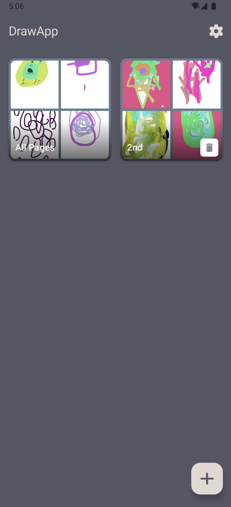
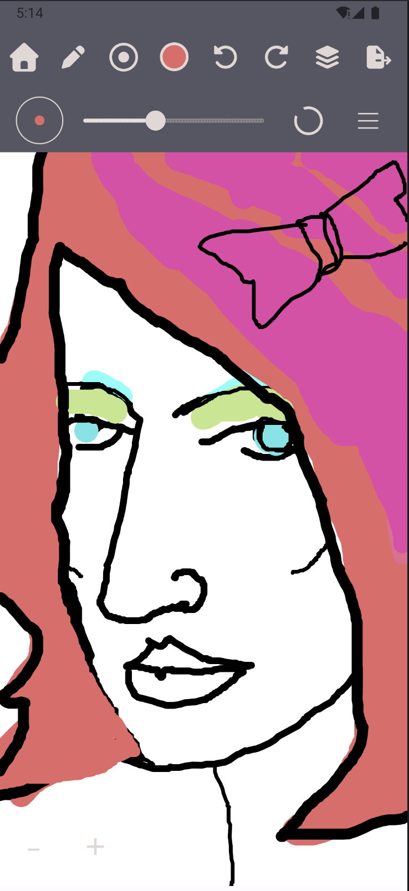
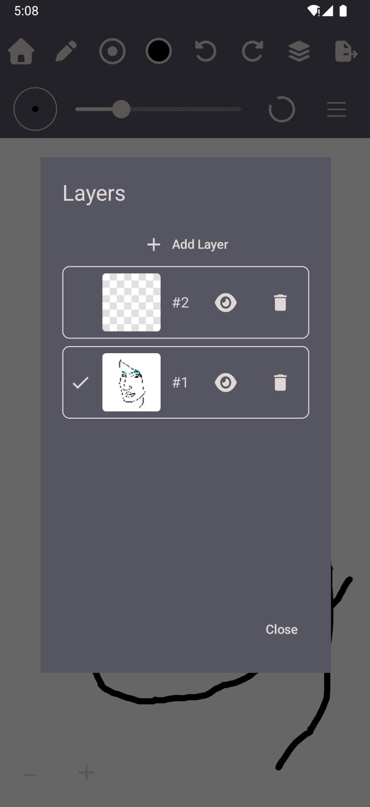
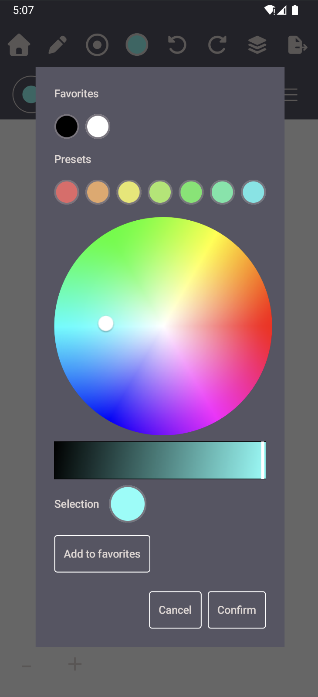

# DrawApp

Android drawing app (Kotlin, Jetpack Compose + a custom `View` canvas). Organize work into notebooks and pages, draw on stacked bitmap layers, and export PNG.

## Screenshots

| Notebooks | Canvas |
| --- | --- |
|  |  |
| **Layers** | **Color picker** |
|  |  |

## Features

### Notebooks and pages
- Create, rename, and delete notebooks
- Add, rename, and delete pages inside a notebook
- Move pages between notebooks
- Notebook preview thumbnails and per-page thumbnails (generated on exit)

### Drawing tools
- **Pen** — opaque stroke
- **Pencil** — same path stroke at 75% alpha
- **Marker** — same path stroke at 60% alpha
- **Eraser** — clears pixels on the current layer (`PorterDuff.Mode.CLEAR`)
- **Oil paint** — dab-based smear that picks up nearby canvas color and runs out along the stroke
- **Fill** — 4-connected scanline flood fill with RGB tolerance
- **Eyedropper** — samples a pixel into the current color
- **Pan** — one-finger pan of the canvas (pinch-zoom still works with other tools)

Stroke tools also place a **dot on tap** (circle or square, matching the cap style).

### Stroke options
- Width from 1–64 px
- Round or square (butt) caps
- Optional **curve smoothing** (moving average + Catmull–Rom spline, applied on finger-up)
- Optional **auto-close** when start and end of a stroke are close enough
- Color wheel + brightness slider, favorite colors, and page background color
- Live stroke preview while drawing (dashed red for eraser)

### Layers
- Multiple independent ARGB bitmaps per page
- Add / delete layers, hide layers, remember the active layer
- Undo / redo per drawing action (strokes, dots, fills)

### View
- Pinch-to-zoom (0.25×–8×) with focus-point scaling
- Two-finger pan; zoom buttons centered on the view
- Pan is clamped so the page stays on screen
- Stroke width is stored in bitmap space (`screenWidth / scale`) so zoomed-in strokes stay the same visual thickness

### Persistence and export
- Pages saved locally as layer PNGs plus JSON stroke metadata (`filesDir/pages/`)
- Tool prefs (size, color, cap, smoothing, closing, favorites) in SharedPreferences
- Export composited PNG to `Pictures/DrawingApp` and share via the system sheet
- Optional AWS S3 backup/restore (Cognito + bucket; only if `AWS_S3_BUCKET` and `AWS_COGNITO_POOL_ID` are set in `app/build.gradle.kts`)

## How drawing is implemented

Touch lives in `DrawingView`, a custom Android `View`. The page is a stack of bitmaps. Pan and zoom are a camera (`scale` then `translate`); they are **not** baked into the bitmaps. Touches are mapped to bitmap coordinates with the inverse matrix. One finger draws or taps; two fingers pan/zoom and cancel an in-progress stroke.

Each tool is a `DrawingTool` strategy (`PenTool`, `OilPaintTool`, …) registered in `ToolRegistry`. On pointer-up the current tool returns a `StrokeIntent` or `TapIntent`. `DrawingScreen` turns that into a `DrawingAction` and `DrawingEngine` runs it (command pattern: execute / undo / redo).

Bitmaps are never painted from the UI directly. `CompositeRenderer` dispatches to:

- **`StrokeRenderer`** — most tools: `Path` + `Paint` (`STROKE`, round or bevel join). Oil paint instead stamps jittered circular dabs, samples pixels behind the brush, carries smear color with exponential decay, and fades the dipped color over stroke length.
- **`DotRenderer`** — filled circle or rect for taps.
- **`FillRenderer`** — scanline flood fill on a locked pixel array (`ColorUtil.floodFill`).

Each `LayerState` keeps the live bitmap **and** a list of `Stroke`s. Undo of a stroke removes it and redraws the rest of that layer from the stroke list (`RedrawStrokesAction`). Fills and dots snapshot the previous bitmap instead.

## Build

Android Studio (or `./gradlew :app:assembleDebug`).

- minSdk 24, compile/target SDK 35
- Gradle 8.10.2, AGP 8.8.1
- Use **JDK 21** for Gradle (the wrapper does not run on JDK 25)

```bash
export JAVA_HOME="/path/to/jdk-21"
./gradlew :app:assembleDebug
```

## License

[MIT](LICENSE)
